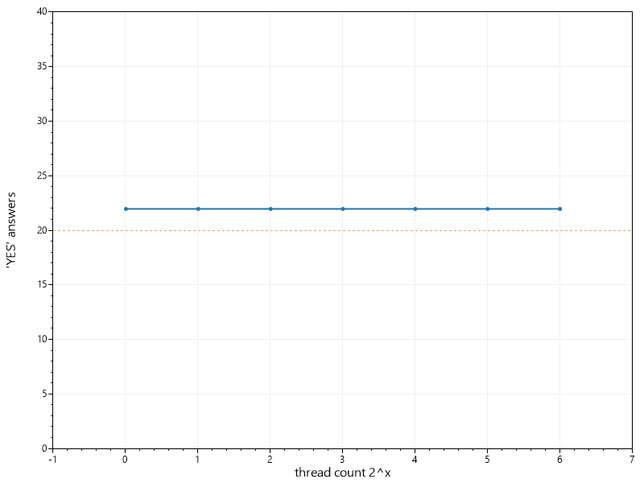

# Important
This project is under construction. Do not use it before the first release version which will be `1.0.0`

Manage rates
============

 

ManageRates is an open-source and cross-platform framework for managing throttling from asp.net core applications. In simple case it is an alternative project to [AspNetCoreRateLimit](https://github.com/stefanprodan/AspNetCoreRateLimit). 

## Documentation
Please, visit https://msgritsenko.github.io/ManageRates/ to get all information about the project.

## Efficiency 
Test of throttling. There is a log of work to this component it I want it works correctly.

## License

ManageRates.AspnetCore licensed under the [MIT License](https://raw.githubusercontent.com/msgritsenko/ManageRates/master/LICENSE).
