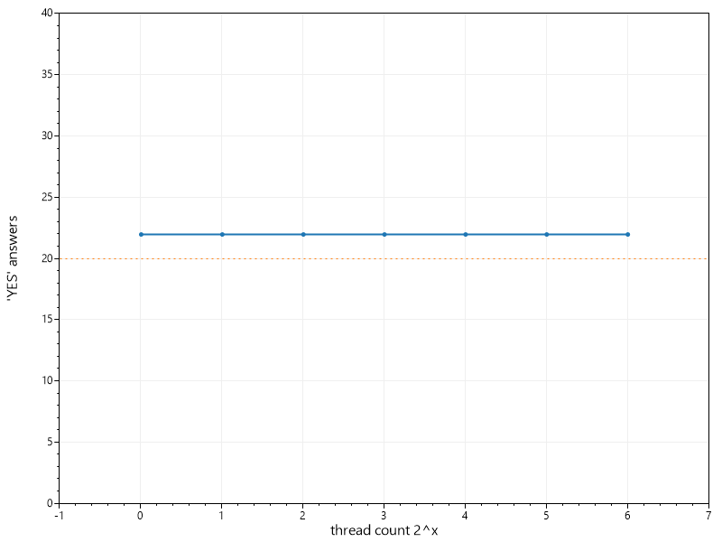

Manage rates
============

[](https://raw.githubusercontent.com/msgritsenko/ManageRates/master/LICENSE)
[](https://ci.appveyor.com/project/msgritsenko/managerates/branch/master)
[](https://www.nuget.org/packages/ManageRates.AspnetCore/) 
[](https://codecov.io/gh/msgritsenko/ManageRates)


ManageRates is an open-source and cross-platform framework for managing throttling from asp.net core applications. In simple case it is an alternative project to [AspNetCoreRateLimit](https://github.com/stefanprodan/AspNetCoreRateLimit). 


## Installation

To install ManageRates packange, run the following command in the Nuget Package Manager Console:

```
PM> Install-Package ManageRates.AspnetCore
```
## Efficiency 
Test of throttling. There is a log of work to this component it I want it works correctly.


## Samples

#### Controller action restriction

Firstly we need to regitster neccessary services:
[!code-csharp[Main](../samples/WebApi/Startup.cs?name=configure_services&highlight=8 "Register services")]
and add the middleware:
[!code-csharp[Main](../samples/WebApi/Startup.cs?range=35-36,43-44,47,58-60,79-81&highlight=5 "Add middleware")]

Finally, we can use attribute on action of a controller to restrinct it's usage:
[!code-csharp[Main](../samples/WebApi/Controllers/MethodAttributesController.cs?name=endpoint_attribute_sample&highlight=2 "Use EndpointManageRateAttribute")]


#### Restriction set of endpoints

Firstly we need to regitster neccessary services:
[!code-csharp[Main](../samples/WebApi/Startup.cs?name=configure_services&highlight=8 "Register services")]

Then we can add the middleware where we describe set of endpoints by regular expression:
[!code-csharp[Main](../samples/WebApi/Startup.cs?range=35-36,43,49-50,57,59-60,79-81&highlight=4-6 "Add middleware")]

#### Add restriction functionality during endpoint configuration:

Firstly we need to regitster neccessary services:
[!code-csharp[Main](../samples/WebApi/Startup.cs?name=configure_services&highlight=8 "Register services")]

Then we can add the middleware where we describe set of endpoints by regular expression:
[!code-csharp[Main](../samples/WebApi/Startup.cs?range=35-36,43,59-62,79-81&highlight=7 "Add middleware")]

## Benchmark results

[!include[BenchmarkResults](../src/Tests/BenchmarkTest/BenchmarkDotNet.Artifacts/results/Benchmark.Test.SingleVsFirst-report-github.md)]

## License

ManageRates.AspnetCore licensed under the [MIT License](https://raw.githubusercontent.com/msgritsenko/ManageRates/master/LICENSE).


